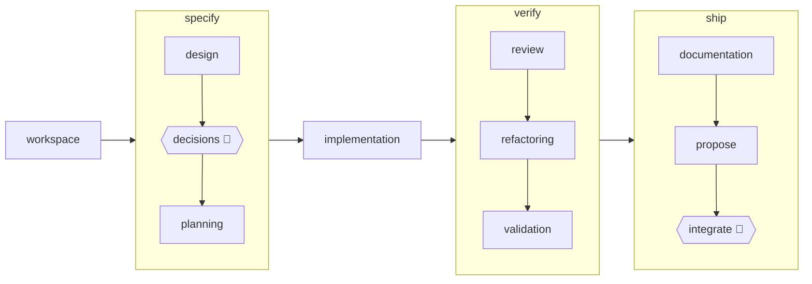

# craft

**A feature-delivery pipeline for your coding agent.** Your agent writes code fast —
craft makes it *deliver*: design docs, ratified decisions, TDD implementation,
multi-dimension review, validation, docs, and a PR, in one gated, resumable run.

[](https://github.com/scolladon/craft/actions/workflows/ci.yml)
[](LICENSE)

Shipped as a Claude Code plugin, with native bindings for seven other runtimes
([`adapters/`](adapters/)). Works zero-config on any repo with a discoverable test command.



🧑 = you decide. Everything else is agents, wired and gated by the engine. Two more
phases ship default-off and turn on with one manifest line: `requirements`
(front-of-pipeline product spec) and `architecture` (a dependency/layering harness).

## Why

Coding agents are great at writing code and bad at *delivering features*: the design
rationale dies with the chat session, nothing forces a review or a green test suite
before commit, and three days later nobody knows why a load-bearing choice was made.

craft externalizes the delivery loop so it survives the transcript:

- **Every rule lives on disk** — in a hook, a script, or versioned instruction text.
  Kill the session mid-run; the next agent resumes from the last committed artifact.
- **Never commit on red.** The engine runs your repo's gate at every cadence boundary.
  Non-negotiable.
- **Decisions are yours, captured as ADRs.** The design phase surfaces decision
  candidates; you ratify them; the *why* outlives the run.
- **Review and validation are real phases**, not vibes — configurable dimensions,
  convergence rounds, and triage, each gating the PR.
- **Big work stays bounded** — git-worktree isolation, a parted TDD plan where each
  part carries its own pre-chewed context block, one role agent per phase.

New to this way of working? [docs/guides/concepts.md](docs/guides/concepts.md) maps
craft onto five frames you may already know — Karpathy's *write-the-loop*, Böckeler's
harness taxonomy, config layering, Osmani's inner/outer loop, and Fowler's *orchestrator
tax*.

## What craft is not

- **Not a prompt pack.** Behavior lives in hooks, scripts, and versioned contracts —
  swap any agent, the contract still binds.
- **Not an autonomy maximizer.** The two human checkpoints are the point: you ratify
  the design decisions, you confirm the merge.
- **Not a hosted service.** A plugin you install; nothing runs anywhere you didn't
  put it.
- **Not a spec generator.** Specs are one optional phase; the unit of work is a
  delivered PR — designed, decided, tested, reviewed, validated, documented.

## Quickstart

```bash
claude plugin marketplace add https://github.com/scolladon/craft
claude plugin install craft@scolladon
```

Then, in any repo that has a test command:

```
/craft:run "add rate limiting to the public API"
/craft:run BACKLOG-42            # or a backlog id
/craft:run path/to/spec.md       # or a spec/PRD file
```

Requirement: **a discoverable test command** (`pytest`, `go test`, `cargo test`,
`make test`, …). No test command → craft refuses to run, by design.

## What a run looks like

```text
/craft:run "add rate limiting to the public API"

workspace       → feature branch + isolated git worktree, deps installed
design          → designer agent writes the design doc, self-reviews to convergence
decisions   🧑  → you ratify each load-bearing choice; each becomes an ADR
planning        → TDD plan split into parts, each with its own pre-chewed context block
implementation  → one implementer agent per part; RED → GREEN → REFACTOR; one commit per part
review          → parallel reviewers, one dimension each; fixes applied until convergence
refactoring     → whole-codebase lens, behavior-preserving; may be an honest no-op
validation      → your repo's engineering harness runs; findings fixed or proven benign
documentation   → affected pages refreshed, backlog entry ticked
propose         → pre-PR gate, push, PR created
integrate   🧑  → CI to green; you confirm the merge; worktree torn down
```

Every phase hands off through a committed artifact — never through chat context — and
the run record accounts for every skip, swap, gate result, and model degradation.

Phases also run standalone, on any branch:

| Command | What it does |
|---|---|
| `/craft:review` | multi-dimension review battery on the current branch |
| `/craft:validation` | scoped harness run + finding triage |
| `/craft:init` | interview-driven manifest generator |
| `/craft:metrics` | mines your transcript history into a usage report |

## craft builds craft

Every feature in this repo was delivered by a craft run, and the artifacts are the
receipts: [18 design docs](docs/contributing/design/), [17 parted plans](docs/contributing/plan/),
[270 ADRs](docs/contributing/adr/), and [raw telemetry for 27 runs](docs/contributing/metrics-baseline.report.json)
— plus an [instantiation record](docs/contributing/archive/SC5-second-instantiation-record.md)
proving the zero-config pipeline on a second, unrelated Python/pytest repo.

The README itself is gated: its example config, pipeline diagram, and cost numbers
are recomputed and checked in CI by [`scripts/readme-drift.sh`](scripts/readme-drift.sh),
so these claims can't silently drift out of sync.

Current status: `v1.0.0`. The engine and Claude Code plugin are dogfooded daily; the
seven adapter bindings are portability proofs, not supported products. The roadmap is
the [BACKLOG](BACKLOG.md), maintained by craft's own documentation phase.

## Make it yours

No manifest = sensible defaults via capability probing. To customize, commit a
`.claude/workflow.md`:

```yaml
pipeline:
  skip: [refactoring]   # dependency-checked: a skip that strands a
                        # downstream phase is refused, not silently applied
```

That's the cheapest of a dozen injection points — skip, insert, reorder, swap
agents/skills, route models per role, tune each harness, change the backlog source,
profiles, up to a derived plugin. Each one has a runnable sample in
[`examples/`](examples/) and a chapter in
[docs/guides/customizing.md](docs/guides/customizing.md) — the one doc to read before
tailoring. Named configs (`.claude/craft-<name>.md`, repo or user scope) select whole
manifests per run: `/craft:run --config <name> …`.

What you *cannot* configure is the invariant core: never commit on red, a gate must
exist for code-producing phases, artifacts (never chat context) are the handoff, and
the run record logs every deviation. Misconfiguration fails loudly
(`scripts/manifest-lint.sh` refuses unknown keys).

## Beyond Claude Code

craft is built hexagonally: a provider-neutral core behind nine ports (execution,
model, gate, backlog, VCS, memory, …). Claude Code is the primary adapter; seven
native bindings under [`adapters/`](adapters/) drive the same engine elsewhere —
proof the seams are real:

| Runtime | Binding shape |
|---|---|
| [pi](adapters/pi/) | headless subprocess — full 11-phase walk (original portability proof) |
| [opencode](adapters/opencode/) | native commands + subagents + enforcing plugin |
| [copilot](adapters/copilot/) | native plugin, shares craft skills by reference |
| [codex](adapters/codex/) | local marketplace + blocking PreToolUse guard |
| [cursor](adapters/cursor/) | headless one-turn agent, live-proven end to end |
| [aider](adapters/aider/) | edit-loop binding; guard declined honestly (no deny surface) |
| [antigravity](adapters/antigravity/) | GUI-driven customization, not a runnable port |

Guard postures and contract-discovery records: [adapters/README.md](adapters/README.md).

## FAQ

**What does a run cost?** Across the [27 telemetered runs](docs/contributing/metrics-baseline.report.json)
that built this repo: the median run logs ≈1.3 hours of role-agent activity, from
half an hour for a small change to ≈5 hours for the largest feature (parallel
fan-outs mean wall-clock is lower). Time concentrates in implementation, validation,
and review. Heavy-reasoning roles (design, review) run on the frontier model;
mechanical roles (implementation, validation, docs) run on a cheaper tier — all
routable per role from the manifest. `/craft:metrics` mines the same report from
your own history.

**Does it work on an existing, messy repo?** Yes — the only precondition is a
discoverable test command. Phases whose tools are absent no-op with a note;
`propose`/`integrate` no-op without a git remote.

**What happens when a gate goes red?** Nothing gets committed — the invariant is
orchestrator-enforced. The phase enters its fix loop; if it can't reach green, the
blocker protocol escalates to you rather than papering over it.

**Can I stop mid-run?** Yes. Every handoff is a committed artifact, so a killed
session resumes from the last artifact — the plan's context blocks, not scrollback.

## Docs

| | |
|---|---|
| [guides/customizing.md](docs/guides/customizing.md) | mental model + full injection catalog |
| [guides/concepts.md](docs/guides/concepts.md) | why craft is shaped this way, in five familiar frames |
| [DESIGN-customizable-engine.md](docs/contributing/prd/DESIGN-customizable-engine.md) | living architecture: phases, ports, enforcement |
| [docs/contributing/adr/](docs/contributing/adr/) | decision records |
| [examples/](examples/) | one runnable sample per injection point |

Contributing to craft itself? Dev loop: `claude --plugin-dir /path/to/craft`.

## License

[MIT](LICENSE) © Sébastien Colladon
