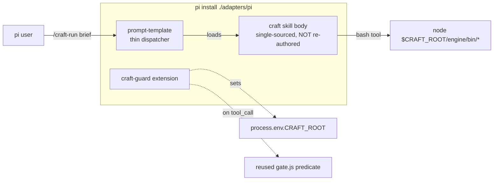

# feat(pi): native pi (pidev) packaging — a discoverable, installable pi binding

## Background

Craft is a hexagonal feature-delivery engine: a thin orchestrator walks a declarative
phase list behind explicit ports (Execution, Model, Telemetry, Gate, …). The engine core
is runtime-neutral plain Node/bash and self-locates — it has three Execution-port
**bindings**: `{ claude, pi, opencode }`.

Two of those three were already *native*. The **opencode** binding shipped a full native
packaging — an installable `opencode.json`, thin `commands/craft-*.md`, `agents/*.md`, a
`git-guard` plugin, a telemetry sibling. The **pi** binding, by contrast, was only a
headless `craft-pi` subprocess bin: it proved the Execution/Model/Gate seams on a non-Claude
runtime, but had **no discoverable surface** — no `pi install`-able package, no
`/craft:*`-equivalent, no pi-native skills. A pi user could not install craft and drive it
interactively the way an opencode user now can.

This change closes that gap: it upgrades pi's *shape* (not the binding set) to a native,
installable package — **without forking the engine**.

## Intuition

Port the opencode native-packaging pattern to pi: **reuse everything the pi adapter already
proves** (`gate.js`, `tool-call-hook.js`, `execution.js`, `roleless*.js`, `probe.js`), and
add only the discoverable surface. pi exposes three first-class discoverable mechanisms, so
the binding uses all three by concern, single-sourcing every load-bearing rule:

The load-bearing discipline: **pin pi's real extensibility empirically, never from memory.**
Probing the live `pi 0.80.10` binary (in an isolated `HOME`/`PI_CODING_AGENT_DIR`) produced a
21-CONFIRMED / 6-DEFERRED matrix — and caught three shape divergences the brief's "reuse
as-is" glossed over:

- The real `pi --mode json` stream carries usage on assistant **`message.usage`**, not the
  `{type:"usage"}` event the 0.79.8-era `parseUsage` expected (dead against 0.80.10).
- The `tool_call` guard event uses **`event.toolName`** (lowercase `bash`/`write`/`edit`),
  blocks by **return** `{block,reason}`, and write/edit carry **`path`** (not `file_path`).
- Non-interactive modes need `--approve` / `defaultProjectTrust:"always"`, or the project
  extension silently never loads.

So the guard *predicate* is reused verbatim; only its *event adapter* is re-expressed for
0.80.10. And the invariant contract is provably identical: pi reuses the existing agent
carve-out variants, so its assembled block is **byte-identical** to Claude's — a zero-line
diff, the strongest form of contract-equivalence.

## Code

Read the diff by idea, not file-by-file:

- **Native surface** (`adapters/pi/`): a `pi` package manifest + `keywords:["pi-package"]`,
  a provider-neutral `settings.template.json`, four thin `/craft-*` prompt-template
  dispatchers (single-sourced from the craft skills), one thin `extensions/craft-guard/index.ts`
  (guard + `registerFlag` + CRAFT_ROOT export, all logic in tested `src/*.js`), and a README.
  A structure test pins the manifest/settings/prompts/extension.
- **Reused seams, re-expressed for 0.80.10**: the git-guard event adapter
  (`tool-call-hook.js` — `toolName`/casing-bridge/`path`→`file_path`/return-to-block) and the
  headless `execution.js#parseUsage` alignment to `message.usage`.
- **New pure seams**: `model-tier-map.js` (`resolvePiModel`, pi-native `claude-*-4-5` ids,
  swappable) and `craft-root.js` (four-up self-locating CRAFT_ROOT resolver, fail-loud).
- **Telemetry** (`engine/src/observability/…`): a new pi `collect` binding
  (`adapters/pi/telemetry.js`) mapping the pinned `message.usage`/`message.model` + a
  **stateful** session id → the vendor-neutral `UsageEvent[]` (reusing `aggregate`/
  `serializeReport` unchanged, byte-parity proven); the `usage-mine` front-door gains
  `--source pi` and a source-aware read root; `telemetry.md`'s reserved `pi` slot is
  repurposed from the never-built Raspberry-Pi metrics idea to the pidev binding.
- **Contract-equivalence** (`engine/test/contract-equivalence.test.js`): a pi zero-line-diff
  assertion (teeth-checked) — no `contract.js` touch.

---

### Provenance & verification

- **Decisions:** ADR-229 … ADR-239 (11 ADRs — 3 ratified by the user, 8 adopted-as-recommended).
- **Design:** `docs/design/native-pi-binding.md` (revised against ADRs 229–239 under the scope-fold rule).
- **Divergences:** DC-6 deviated from the designer's recommendation — the user chose to *also*
  align the latent-bug `execution.js#parseUsage` to pi 0.80.10 in-scope (rather than defer it),
  triggering a design revision (§R-10, §D6b) before planning. All other decisions matched the design.
- **Pinned behaviours (locked by tests):** pi 0.80.10 `tool_call` shape (`toolName`, lowercase
  casing bridge, `path`, return-to-block); the git-guard checks the **authoritative `path`** so an
  in-tree `file_path` decoy cannot mask an out-of-tree escape; `message.usage` schema drives both
  the headless `parseUsage` and the telemetry binding, type-gated to `message_end`; telemetry
  redaction is whitelist-only (no PII leak); `report.json` byte-parity with the claude path;
  contract zero-line carve-out diff.
- **Test plan:** full `ci.sh` green — engine 1864, adapters/pi 279, adapters/opencode 229,
  process 186 (0 fail). Mutation per-hunk over the 2 changed engine/src files: 77 mutants →
  **74 killed + 3 documented-equivalent, 0 no-coverage**. Contract-equivalence teeth-checked.
  On-demand live smoke (a construction phase through the native pi surface, trusted install,
  guard blocking a non-compliant `git diff`) is **DEFERRED** and recorded as the D-row agenda in
  `docs/adapters/pi-poc-record.md` — not CI-gated (pi/opencode precedent).
- **Follow-up candidate:** `numOrZero` is now an identical 1-line helper in all three telemetry
  siblings (claude/opencode/pi); whether to centralize it (vs the deliberate sibling-independence
  pattern) is a design-sized decision, deliberately left out of this change (refactoring no-op).
- **Run record:**
  - `default-skip: requirements, architecture` (descriptor `enabled:false`)
  - `GATE(planning): green` (plan-lint) · `GATE(implementation): green` · `GATE(review): green` · `GATE(validation): green`
  - `decisions`: 3 escalated / 8 adopted-as-recommended → ADR-229…239
  - `INTENTION-DRIFT(telemetry.md)`: reserved `pi` slot repurposed for pidev — sanctioned via ADR-238
  - `NO-OP(refactoring): nothing cleared the bar` — only dup is the trivial numOrZero 1-liner (out-of-scope to centralize)
  - `verify: DoD met` — 11 criteria (implementation+review gates auto-met; techniques-triaged via mutation; architecture-gap-honest: architecture phase OFF, boundary check did not run)
  - `intention: fresh` — assert-fresh 3 paths valid, no unwaived drift
  - Engine untouched except the additive pi telemetry sibling + the generic `--source`/read-root selector.
