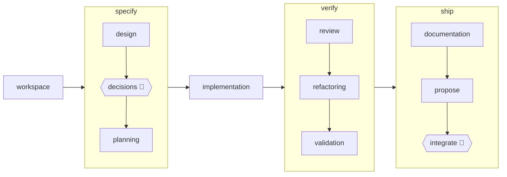

# Plan — readme-drift-guards

> Source: design doc `docs/design/readme-drift-guards.md` · ADRs `271, 272, 273, 274, 275, 276`
> The plan is the implementation script AND the knowledge handoff. Part agents start
> with zero context: whatever a part block omits is paid later as agent rediscovery.
> `plan-lint.sh` enforces the schema below — the plan phase cannot close without it.

## Sizing rules

- Every part costs a full agent lifecycle (spin-up, zero-context rebuild, gate) — it
  must earn it. No standalone test-only parts for FEATURE code: coverage/property tests
  fold into the implementation part whose code they exercise. EXCEPTION: test-infra /
  docs-only parts with no `src/` delta ARE standalone (none here).
- A part that would be a pure test pass over already-landed code merges into its neighbour.

## Plan shape (5 parts, sequential, one working tree)

| # | Part | Home | src delta |
|---|---|---|---|
| 1 | Pure core `readme-regions.js` — README text → regions | `engine/src` | yes |
| 2 | Pure core `phase-truth.js` — descriptors → enabled phase-id set | `engine/src` | yes |
| 3 | Pure core `telemetry-claims.js` — report → recomputed+compared claims | `engine/src` | yes |
| 4 | Orchestrator `readme-drift-main.js` + bin `engine/bin/readme-drift.js` | `engine/src`+`bin` | yes |
| 5 | Front door `scripts/readme-drift.sh` + front-door test + `readme-drift` CI job | `scripts`+`test`+`.github` | no `src/` |

Ordering is load-bearing: Parts 1–3 are three independent pure cores sharing no source
file; Part 4 imports all three and wires file I/O; Part 5 shells Part 4's bin and gates it
in CI. Parts run sequentially in one working tree; each is one atomic commit.

## Public-surface decision — ALL new symbols are INTERNAL (no barrel entry)

`engine/src/index.js` is a CURATED public barrel (`parsePipeline`, `validatePipeline`,
`ALIAS_MAP`/`resolveAlias`, `resolvePipeline`, `assembleContract`, `normalizeFindings`,
`validateManifest`, policy exports). It deliberately omits every `*-main.js` core and the
modules reached only through a bin shim — e.g. `manifest-lint-main.js`, `usage-mine-main.js`,
`frontmatter.js`. The three new cores (`readme-regions`, `phase-truth`, `telemetry-claims`)
and the orchestrator (`readme-drift-main`) are consumed ONLY by `engine/bin/readme-drift.js`
via relative import, exactly like `manifest-lint.js` → `../src/manifest-lint-main.js`.
**No new module is added to `engine/src/index.js`.** There is no barrel-completeness test to
satisfy. The only external consumer surface this feature publishes is the `readme-drift` CI
job name (Part 5) — no export.

## Surface gates every engine-code part pre-pays (Parts 1–4)

- **`engine/test/source-hygiene.test.js`** enumerates `engine/src/**/*.js` and fails on any
  provenance ref matching `/\b(ADR-?\d+|P\d+|Part\s+\d+|backlog\s*#\d+)\b/i`. New cores MUST
  carry NO provenance refs (no `ADR-273`, `Part 4`, backlog numbers) in code or comments —
  state rationale in plain prose.
- **`test/source-hygiene.test.js`** greps `engine/src` (among others) for Class-A
  `stryker|mutmut|cosmic-ray|cargo-mutants|mutation|mutant|dependency-cruiser|depcruise` and
  Class-B `\bgh\b|\bgithub\b`. New cores MUST NOT contain the bare words `mutation`/`mutant`/
  `stryker` or `github`/`gh`. The ONLY allowlisted exception is the dogfood convention
  `// equivalent mutant (…)` / `mutant unreachable` — use that exact phrasing when documenting
  a survivor line, nothing else. No vendor-suffixed filenames (Class-C) — the chosen basenames
  are all neutral.
- **Mutation scope is a glob.** `engine/stryker.conf.json` has `mutate: ["engine/src/**/*.js", …]`
  and `tap.testFiles: ["engine/test/**/*.test.js", …]`. New `engine/src/*.js` files are
  auto-mutated and new `engine/test/*.test.js` files auto-cover them — **no config edit**.
  `engine/test/mutation-config.test.js` only inspects `adapters/` entries, so it is untouched.
  Obligation, not edit: the folded unit tests must be thorough enough to kill mutants
  (branch/boundary coverage on the filter, the rounding table, the extraction regexes).
- **Test registration is automatic.** `scripts/ci.sh` runs `run_suite engine engine/test engine`
  and `run_suite process test`, each `find`-ing `*.test.js` — new test files are discovered with
  no ci.sh edit. `shellcheck scripts/*.sh` (also in ci.sh) auto-covers Part 5's new script.
  `test/every-test-file-registers.test.js` requires each new `*.test.js` to register ≥1
  `test(`/`it(`/`describe(` token OUTSIDE comments/strings — satisfied by writing real tests.
  **`scripts/ci.sh` needs NO manual edit in any part** (this ci.sh has no `EXPECTED_TESTS`
  counter — do not look for one).

## Input-discovery contract (Parts 4 & 5) — pinned so tests can drive mutated trees

`readme-drift-main.js` reads three inputs at fixed repo-relative paths under a *root* it
resolves once:

```
const DEFAULT_ROOT = resolve(dirname(fileURLToPath(import.meta.url)), '..', '..'); // engine/src → repo root
export function main(argv, io) {
  const root = argv[0] ? resolve(argv[0]) : DEFAULT_ROOT;
  // reads: join(root,'README.md'), join(root,'pipeline/default.yml'),
  //        join(root,'docs/metrics-baseline.report.json')
}
```

- No-arg run (CI job, contributor from anywhere) → `DEFAULT_ROOT` (bin-relative) → the real repo.
- An explicit `argv[0]` root → that tree. This is the ONLY seam the bin-smoke test and the
  front-door test use to point the guard at a mktemp copy holding just the three mutated files.
- `scripts/readme-drift.sh` forwards `"$@"` verbatim: `exec node "$ROOT/engine/bin/readme-drift.js" "$@"`
  where its own `ROOT` locates the (real) engine bin. The script does NOT `cd`.

## Pinned bytes — reproduce these exactly in fixtures/asserts

**Enabled phase-id set (Part 2 & 4), in `pipeline/default.yml` order (11 ids):**
`workspace design decisions planning implementation review refactoring validation documentation
propose integrate`. The two `enabled: false` descriptors excluded: `requirements`, `architecture`.

**README mermaid block (Part 1), verbatim (`README.md` lines 13–27):**
````

````
Node labels come from `[...]` (rectangles) and `{{"..."}}` (hexagons). Strip a trailing `🧑`
+ whitespace (`decisions 🧑`→`decisions`, `integrate 🧑`→`integrate`). EXCLUDE `[...]` on a line
whose first non-space token is `subgraph` — those are group labels `specify`/`verify`/`ship`,
NOT phases. Extracted set = the 11 enabled ids above.

**README timeline block (Part 1), verbatim (`README.md` lines 87–101):** a `text` fenced block.
Take the first whitespace-delimited token of every line CONTAINING `→`; strip a trailing `🧑`.
The `/craft:run "…"` first line has no `→` → skipped. `decisions   🧑  → …`→`decisions`,
`integrate   🧑  → …`→`integrate`. Extracted set = the 11 enabled ids above.

**README manifest snippet (Part 1 & 4), the single `yaml` fenced block (`README.md` lines 132–136):**
```
pipeline:
  skip: [refactoring]   # dependency-checked: a skip that strands a
                        # downstream phase is refused, not silently applied
```
Extract the block body between the ```` ```yaml ```` and closing ```` ``` ```` fence (inline `#`
comments included — valid YAML). Zero `yaml` blocks found ⇒ report as drift, never a silent pass.

**README FAQ cost sentence (Part 1 & 4), verbatim (`README.md` lines 172–174):**
> **What does a run cost?** Across the `[27 telemetered runs](docs/metrics-baseline.report.json)`
> that built this repo: the median run logs ≈1.3 hours of role-agent activity, from
> half an hour for a small change to ≈5 hours for the largest feature …

Anchor extraction on the `What does a run cost?` question text, then pull four tokens:
`(\d+) telemetered runs`→`27`; the FIRST `≈([\d.]+) hours`→`1.3` (median); the literal
`half an hour` (min); `≈(\d+) hours`→`5` (max — the integer form uniquely skips `≈1.3 hours`).

**Telemetry recompute (Part 3 & 4), pinned from today's `docs/metrics-baseline.report.json`
(top-level `{schemaVersion, recommendations, runs[]}`; each run `{run, slug, reviewCycles,
groups[]}`; each group carries `durationMs`):**

| Aggregate | Raw | Rounding rule | README token |
|---|---|---|---|
| run count | `27` (`runs.length`) | exact integer | `27` |
| duration-bearing runs | `26` (per-run Σ`durationMs` > 0; 1 run sums to 0) | — | — |
| median hours | `1.2942` (even n=26 ⇒ avg of the two central order statistics) | round 1 dp | `1.3` |
| min hours | `0.4609` | nearest `0.5` ⇒ phrase `half an hour` | `half an hour` |
| max hours | `5.0083` | round to integer | `5` |

Hours = `durationMs / 3_600_000`. Median convention is FIXED to average-of-two (ADR-274); do
NOT use the upper-middle statistic (`1.3078`). The all-zero-duration run is excluded from
min/max/median but still counted in `runCount`.

**Finding format (Part 4):** one line per drift, `readme-drift: <surface>: <detail>`, run-all
(collect every drift, print all, exit non-zero if any). Recommended surface tokens the tests
assert on: `manifest-snippet` (detail = the validator's own error), `phase-names:mermaid`,
`phase-names:timeline` (detail names the extra/missing id), `telemetry:runCount`,
`telemetry:median`, `telemetry:min`, `telemetry:max` (detail names README value AND recomputed
value). A structurally-absent input (zero `yaml` blocks) is itself a finding, never a no-op.

## Part 1 — Pure core `readme-regions.js`

### Context

- **Create** `engine/src/readme-regions.js` (ESM; engine `package.json` is `"type":"module"`).
  Pure, side-effect-free: input is the README **string**, output is a plain object of extracted
  regions. No `fs`, no `js-yaml` here — parsing/validation belongs to Part 4. This module is
  ONLY string→value extraction anchored on fenced-block info-strings and the FAQ heading, never
  line numbers (design §Design; requirement: unrelated README edits must not shift the guard).
- **Recommended export** (single entry keeps the seam small):
  `export function extractReadmeRegions(readme)` returning
  `{ yamlBlocks: string[], mermaidPhases: string[], timelinePhases: string[], costClaims: { runCount: string, median: string, min: string, max: string } }`.
  Split private helpers per region if a function nears 20 lines (Object Calisthenics / small
  functions). Return arrays as extracted (order-preserving); set-equality is Part 4's job.
- **Extraction rules** — reproduce the pinned-bytes section exactly:
  - *yaml blocks*: every fenced block whose opening info-string is exactly `yaml`; body = lines
    strictly between the opening ```` ```yaml ```` and the next ```` ``` ````. Support 0, 1, N
    blocks. Today there is exactly 1.
  - *mermaid phases*: from the single `mermaid` block, capture `[...]` and `{{"..."}}` labels;
    strip trailing `🧑`+space; DROP any `[...]` on a line whose first token is `subgraph`.
  - *timeline phases*: from the single `text` block, first token of each line containing `→`;
    strip trailing `🧑`; the `/craft:run` line (no `→`) is skipped.
  - *cost claims*: anchor on `What does a run cost?`; extract the four tokens (regexes pinned above).
- **Test file** `engine/test/readme-regions.test.js` (ESM, `import { test } from 'node:test'`,
  `import assert from 'node:assert/strict'`). Follow the repo house style: Given/When/Then titles,
  AAA body, `sut` variable (see `engine/test/frontmatter.test.js`, `manifest-lint.bin.test.js`).
  Use small inline fixture strings — NOT the whole README — so each case is legible.
- **Surface gates:** no provenance refs; no Class-A/B tokens (see gates section). INTERNAL — not
  added to `engine/src/index.js`.

### TDD steps

- RED — write `engine/test/readme-regions.test.js`; module does not exist yet ⇒ import fails /
  cases fail. Cases:
  1. Given a fragment with 0, then 1, then 2 `yaml` fenced blocks, when extracted, then
     `yamlBlocks.length` is 0 / 1 / 2 and each body is the between-fence text verbatim.
  2. Given the pinned mermaid block, when extracted, then `mermaidPhases` is the 11 enabled ids —
     `specify`/`verify`/`ship` subgraph labels EXCLUDED and `🧑` stripped from `decisions`/`integrate`.
  3. Given the pinned timeline block, when extracted, then `timelinePhases` is the 11 enabled ids
     and the `/craft:run` line is skipped.
  4. Given the pinned FAQ sentence, when extracted, then `costClaims` = `{runCount:'27',
     median:'1.3', min:'half an hour', max:'5'}` (median token is `1.3`, NOT `5`).
  5. Property lens: Given a fragment with extra unrelated prose/blank lines inserted between the
     regions, when extracted, then the four region results are unchanged (anchor-not-offset proof).
- GREEN — implement `extractReadmeRegions` + private helpers minimally to pass.
- REFACTOR — extract a shared fenced-block reader (info-string → body) reused by the yaml/mermaid/
  text captures; early returns; named constants for the info-strings and the FAQ anchor. Keep
  every function < 20 lines, nesting ≤ 2.

### Gate

`node --test engine/test/readme-regions.test.js` (run from repo root; green, non-empty).

### Commit

`feat(engine): extract README drift-guard regions`

## Part 2 — Pure core `phase-truth.js`

### Context

- **Create** `engine/src/phase-truth.js` (ESM). Pure: input is an **array of already-parsed
  descriptor objects** (Part 4 does `js-yaml` `load` of `pipeline/default.yml`); output is the
  enabled phase-id set. Keeping `load()` in Part 4 makes the risky filter trivially unit-testable
  with literal arrays and mutation-covered.
- **Recommended export** `export function enabledPhaseIds(descriptors)` returning `string[]`
  (the `id`s, order-preserving) OR a `Set` — pick one and be consistent; Part 4 compares as sets.
- **The filter MUST be explicit (ADR-271, ADR-276; design footgun pin):** keep a descriptor
  unless it *explicitly* carries `enabled: false`. Concretely
  `descriptors.filter(d => !(Object.prototype.hasOwnProperty.call(d, 'enabled') && d.enabled === false)).map(d => d.id)`.
  DO NOT write `d.enabled ?? true`, `d.enabled || true`, or a `.enabled // true` analogue — those
  return `true` for `enabled: false` and silently pull `requirements`/`architecture` in. A unit
  test pins the exclusion.
- **Descriptor shape** (from `pipeline/default.yml`): each is `{ id, archetype, …, enabled? }`;
  `enabled` is absent (⇒ enabled) or `false`. `requirements` and `architecture` are the only two
  with `enabled: false`. Real parsed file yields the 11-id set in the pinned-bytes section.
- **Test file** `engine/test/phase-truth.test.js` (ESM, Given/When/Then, `sut`). Hand-built
  descriptor arrays — do NOT read the real YAML here (that path is covered by Part 4/5 against the
  live tree).
- **Surface gates:** no provenance refs; no Class-A/B tokens. INTERNAL — not in `index.js`.

### TDD steps

- RED — write `engine/test/phase-truth.test.js`; module absent ⇒ fails. Cases:
  1. Given `[{id:'a'},{id:'b',enabled:false},{id:'c'}]`, when `enabledPhaseIds`, then `['a','c']`
     — the FOOTGUN regression: `enabled:false` is dropped, not kept.
  2. Given a descriptor with no `enabled` key, when filtered, then it is kept (absent ⇒ enabled).
  3. Given a descriptor with `enabled:true`, when filtered, then it is kept.
  4. Given a 13-descriptor list mirroring `default.yml` (two with `enabled:false`), when filtered,
     then exactly the 11 pinned ids remain, order-insensitive.
- GREEN — implement the explicit filter minimally.
- REFACTOR — name the predicate (e.g. `isEnabled`) as a small pure function; early return; keep
  the hasOwnProperty/`=== false` check together with a `why` comment (the footgun), no `what`.

### Gate

`node --test engine/test/phase-truth.test.js` (from repo root; green, non-empty).

### Commit

`feat(engine): derive enabled phase-id truth set for README guard`

## Part 3 — Pure core `telemetry-claims.js`

### Context

- **Create** `engine/src/telemetry-claims.js` (ESM). Pure & deterministic: NO clock, NO network,
  NO randomness (requirement 7). Input is the parsed report **object** (Part 4 does `JSON.parse`);
  output is the recomputed aggregates plus a comparison against README claim tokens.
- **Report shape** (top-level `{schemaVersion, recommendations, runs[]}`): each `run` has
  `groups[]`; each group carries `durationMs` (integer ms). Per-run duration = Σ of its groups'
  `durationMs`. See pinned-bytes recompute table.
- **Recommended exports (two, CQS-clean):**
  - `export function recomputeClaims(report)` → `{ runCount, medianHours, minHours, maxHours }`
    (RAW numbers). `runCount = report.runs.length`. Over duration-bearing runs (per-run Σ > 0),
    hours = `ms/3_600_000`: `minHours`, `maxHours`, and `medianHours` = for even n the average of
    the two central order statistics of the SORTED hours, for odd n the middle one.
  - `export function compareClaims(recomputed, costClaims)` → `string[]` of drift findings
    (empty ⇒ no drift). Apply the rounding rules and compare to the README tokens
    (`costClaims` from Part 1): runCount exact int vs `Number(costClaims.runCount)`; median
    `medianHours` rounded to 1 dp vs `costClaims.median`; min `minHours` rounded to nearest `0.5`
    — assert it equals `0.5` AND `costClaims.min === 'half an hour'`; max `maxHours` rounded to
    integer vs `Number(costClaims.max)`. Each mismatch → a finding string naming the README value
    and the recomputed value (surface tokens `telemetry:runCount|median|min|max`).
- **Rounding helpers** — small named functions: `round1(x)=Math.round(x*10)/10`,
  `nearestHalf(x)=Math.round(x*2)/2`, `roundInt(x)=Math.round(x)`. Avoid float-format traps: compare
  numbers, format for the message only.
- **Test file** `engine/test/telemetry-claims.test.js` (ESM, Given/When/Then, `sut`). Hand-built
  minimal report objects with known medians — NOT the real report.
- **Surface gates:** no provenance refs; no Class-A/B tokens (do NOT write the word `mutation`).
  INTERNAL — not in `index.js`.

### TDD steps

- RED — write `engine/test/telemetry-claims.test.js`; module absent ⇒ fails. Cases:
  1. Given a report of N runs, when `recomputeClaims`, then `runCount === N` (counts ALL runs).
  2. Given 4 duration-bearing runs with hours `[1,2,3,4]` (even n), when `recomputeClaims`, then
     `medianHours === 2.5` (average-of-two), `minHours===1`, `maxHours===4`.
  3. Given 3 duration-bearing runs `[1,2,4]` (odd n), then `medianHours===2`.
  4. Given a report where one run's groups all sum to `0`, when `recomputeClaims`, then that run
     is EXCLUDED from median/min/max but INCLUDED in `runCount`.
  5. Given recomputed raws `{runCount:27, medianHours:1.2942, minHours:0.4609, maxHours:5.0083}`
     and matching README tokens `{runCount:'27', median:'1.3', min:'half an hour', max:'5'}`, when
     `compareClaims`, then `[]` (today's tree is clean).
  6. Given the same tokens but a report whose median-bearing durations are bumped so `medianHours`
     rounds to `1.4`, when `compareClaims`, then a finding names `telemetry:median` with `1.3`
     (README) and `1.4` (report) — drift flips the verdict.
  7. Given `minHours` that rounds to `1.0` (not `0.5`), then a `telemetry:min` finding is produced.
- GREEN — implement `recomputeClaims` + `compareClaims` + rounding helpers minimally.
- REFACTOR — extract per-run duration summation and the sorted-hours build; median as its own
  pure function; immutable (no in-place sort of a caller array — sort a copy). Functions < 20 lines.

### Gate

`node --test engine/test/telemetry-claims.test.js` (from repo root; green, non-empty).

### Commit

`feat(engine): recompute and compare telemetry claims for README guard`

## Part 4 — Orchestrator `readme-drift-main.js` + bin shim

### Context

- **Create** `engine/src/readme-drift-main.js` (ESM) — the file-I/O + aggregation layer over the
  three Part 1–3 cores; **create** `engine/bin/readme-drift.js` — the ~5-line shim.
- **Imports:** `import { readFileSync } from 'node:fs'`; `import { resolve, dirname, join } from
  'node:path'`; `import { fileURLToPath } from 'node:url'`; `import { load } from 'js-yaml'`;
  `import { extractFrontmatter } from './frontmatter.js'`;
  `import { validateManifest } from './manifest.js'`;
  `import { extractReadmeRegions } from './readme-regions.js'`;
  `import { enabledPhaseIds } from './phase-truth.js'`;
  `import { recomputeClaims, compareClaims } from './telemetry-claims.js'`.
- **Signature & root resolution:** `export function main(argv, io)` returning an exit code
  (`0` clean, `1` drift/error). Resolve the root per the pinned Input-discovery contract
  (`DEFAULT_ROOT = resolve(dirname(fileURLToPath(import.meta.url)), '..', '..')`; `argv[0]`
  overrides). `io` is `{ stdout, stderr }` with `.write(s)` (mirror `manifest-lint-main.js`
  `main(argv, io)` exactly — that signature is the repo precedent for testable bins).
- **Three sub-guards, run-all (collect, then exit):**
  1. *manifest snippet* (ADR-273): read `join(root,'README.md')` → `extractReadmeRegions`. For
     EACH `yamlBlocks[i]`: wrap in memory as `` `---\n${block}\n---\nx\n` ``, run
     `extractFrontmatter(wrapped)` → `load(fm)` → `validateManifest(parsed, {})` (default opts;
     the snippet has no file refs, so `fileExists`/`readFile` are irrelevant). Any `!ok` → push a
     `manifest-snippet` finding carrying each `errors[]` string. Zero `yamlBlocks` → a
     `manifest-snippet` finding (absent input is drift, ADR-273 / design §Failure semantics).
     Wrap `load` in try/catch → malformed snippet becomes a finding, never a swallowed throw.
  2. *phase names* (ADR-271/276): `load(readFileSync(join(root,'pipeline/default.yml')))` →
     `enabledPhaseIds(...)`. Compare that id set pairwise with `mermaidPhases` and `timelinePhases`
     as sets (order-insensitive). For each surface, emit `phase-names:mermaid` /
     `phase-names:timeline` findings naming ids only-in-truth (missing from README) and
     only-in-README (extra).
  3. *telemetry claims* (ADR-274): `JSON.parse(readFileSync(join(root,'docs/metrics-baseline.report.json')))`
     → `recomputeClaims` → `compareClaims(recomputed, regions.costClaims)`; push each finding.
  - Print every finding via `io.stdout.write` as `readme-drift: <surface>: <detail>\n`; return `1`
    if any finding else `0`. No fail-fast — one run surfaces every drift (design §Failure semantics).
- **Bin** `engine/bin/readme-drift.js` — copy the `manifest-lint.js` shim shape verbatim, retargeted:
  ```
  #!/usr/bin/env node
  import { fileURLToPath } from 'node:url';
  import { main } from '../src/readme-drift-main.js';
  if (process.argv[1] === fileURLToPath(import.meta.url)) {
    process.exit(main(process.argv.slice(2), { stdout: process.stdout, stderr: process.stderr }));
  }
  ```
  Bins are never mutation-mutated and carry no logic (design §engine/bin convention).
- **Two folded test files** (both fold here — they exercise Part 4's code):
  - `engine/test/readme-drift-main.test.js` (ESM, IN-PROCESS) — import `main`, inject a fake `io`
    that captures writes, point `argv[0]` at a `mkdtempSync` root holding the three files. This is
    what gives `readme-drift-main.js` its mutation coverage (subprocess spawns do not). Cases below.
  - `engine/test/readme-drift.bin.test.js` (ESM, SUBPROCESS smoke) — `spawnSync(process.execPath,
    [bin, root])` against a mktemp tree; assert `status` + `stdout`. Mirror
    `engine/test/dod-assert.bin.test.js` and `manifest-lint.bin.test.js` (mkdtemp/writeFileSync/rmSync).
- **Fixture-tree helper (both tests):** build a throwaway root with `mkdtempSync(join(tmpdir(),
  'readme-drift-'))`, then `README.md`, `pipeline/default.yml`, `docs/metrics-baseline.report.json`.
  Seed from a KNOWN-GOOD minimal set (small README with the four regions + a small 13-descriptor
  default.yml + a small report whose recompute matches the README tokens) so "clean → 0" is
  self-contained and fast. State-mutating fixtures live only in the mktemp throwaway, never the worktree.
- **Surface gates:** `readme-drift-main.js` is under `engine/src/**` → auto-mutated (thorough
  in-process cases required). No provenance refs; no Class-A/B tokens (avoid `mutation`/`mutant`/
  `github`; the `// equivalent mutant (…)` convention is the only allowlisted survivor comment).
  INTERNAL — not in `index.js`. `engine/bin/readme-drift.js` needs `chmod 0755` to match sibling bins.

### TDD steps

- RED — write both test files first; `readme-drift-main.js` / bin absent ⇒ import/spawn fails. Cases
  (in-process `readme-drift-main.test.js` unless noted):
  1. Given a clean mktemp tree, when `main([root], fakeIo)`, then returns `0` and writes no finding.
  2. Given a tree whose `pipeline/default.yml` renames an enabled id (e.g. `design`→`desing`), when
     `main`, then returns `1` and stdout contains `phase-names:mermaid` and `phase-names:timeline`
     naming the drifted id.
  3. Given a tree whose README `yaml` block uses an unknown pipeline key (`bogusKey: [refactoring]`),
     when `main`, then returns `1` and stdout contains `manifest-snippet` + the validator error
     substring `unknown pipeline key`.
  4. Given a tree whose README has ZERO `yaml` blocks, when `main`, then returns `1` with a
     `manifest-snippet` finding (absent input is drift).
  5. Given a tree whose report bumps a duration so the median rounds off, when `main`, then returns
     `1` with a `telemetry:median` finding naming both values.
  6. Given a tree with a renamed phase AND an unknown snippet key AND a telemetry bump, when `main`,
     then stdout carries findings for ALL three surfaces (run-all, not fail-fast) and returns `1`.
  7. (bin smoke, `readme-drift.bin.test.js`) Given a clean mktemp tree, when the bin is spawned with
     the root arg, then `status===0`; given a renamed-phase tree, then `status!==0` and stdout names
     the surface.
- GREEN — implement `main` (root resolution, three sub-guards, aggregation, exit code) + the bin shim.
- REFACTOR — one small function per sub-guard returning `string[]` findings; a shared set-diff
  helper for phase names; the manifest-wrap as a named helper. Early returns; no swallowed errors
  (wrap `load`/`JSON.parse` so a malformed input becomes a printed finding, not an uncaught throw);
  functions < 20 lines.

### Gate

`node --test engine/test/readme-drift-main.test.js engine/test/readme-drift.bin.test.js`
(from repo root; both green, non-empty).

### Commit

`feat(engine): orchestrate README drift sub-guards behind a bin`

## Part 5 — Front door `scripts/readme-drift.sh` + front-door test + `readme-drift` CI job

### Context

- **Create** `scripts/readme-drift.sh` — the one-command local front door AND what CI runs (ADR-275,
  requirement 5). Mirror `scripts/manifest-lint.sh` byte-shape, retargeted:
  ```
  #!/usr/bin/env bash
  set -euo pipefail
  ROOT="$(cd "$(dirname "${BASH_SOURCE[0]}")/.." && pwd)"
  exec node "$ROOT/engine/bin/readme-drift.js" "$@"
  ```
  `ROOT` locates the real engine bin; `"$@"` forwards an optional target-root arg to the bin (see
  Input-discovery contract). MUST be shellcheck-clean — `scripts/ci.sh` runs `shellcheck scripts/*.sh`
  and will pick this up with no edit. `chmod 0755`.
- **Create** `test/readme-drift.test.js` — the front-door test. **CommonJS** (repo root has NO
  `package.json`, so `test/*.test.js` default to CJS): `'use strict'; const { test } =
  require('node:test'); const assert = require('node:assert');`. Copy the structure of
  `test/manifest-lint.test.js` (`execFileSync('bash', [SCRIPT, ...args])`, catch non-zero via
  `err.status`/`err.stdout`/`err.stderr`). Helpers: `path.join(__dirname,'..')` = repo ROOT;
  `SCRIPT = path.join(ROOT,'scripts','readme-drift.sh')`.
  - *Live-tree pass:* run `bash scripts/readme-drift.sh <ROOT>` (pass the real repo root as the arg)
    → assert `status === 0`. This is the acceptance proof that today's tree is clean.
  - *Three mutated copies* (each in its own `fs.mkdtempSync` throwaway; copy the three real inputs
    with `fs.copyFileSync`, mutate ONE, then run `bash scripts/readme-drift.sh <tmpRoot>`):
    (a) rename an enabled id in the copied `pipeline/default.yml` → assert non-zero + stdout has
    `phase-names`; (b) inject an unknown key into the copied README's `yaml` block → assert
    non-zero + `manifest-snippet`; (c) bump a duration-bearing group's `durationMs` in the copied
    report (e.g. scale so the 1-dp median changes) → assert non-zero + `telemetry`. `rmSync(...,
    {recursive:true,force:true})` in `finally`.
  - Given/When/Then titles, `sut`, AAA. Auto-discovered by `run_suite process test` (no ci.sh edit);
    registers real `test(` calls so `test/every-test-file-registers.test.js` stays green.
- **Edit** `.github/workflows/ci.yml` — add a THIRD job `readme-drift` alongside `ci` and `links`
  (ADR-275). Model its steps on the existing `ci` job's node setup (do NOT copy the bats/shellcheck/
  jq/yq installs — the node home needs none):
  ```
  readme-drift:
    runs-on: ubuntu-latest
    steps:
      - uses: actions/checkout@v4
      - uses: actions/setup-node@v4
        with:
          node-version: '22'
          cache: npm
          cache-dependency-path: engine/package-lock.json
      - name: Install engine dependencies
        run: cd engine && npm ci
      - name: README drift guard
        run: bash scripts/readme-drift.sh
  ```
  No-arg run ⇒ the bin's `DEFAULT_ROOT` reads the checked-out repo. Keep the two existing jobs
  untouched.
- **Do NOT edit `scripts/ci.sh`** — ADR-275 keeps the guard a separate job; ci.sh already
  auto-discovers `test/readme-drift.test.js` (via `run_suite process test`) and shellchecks the new
  script (via `shellcheck scripts/*.sh`). Folding the guard into ci.sh would violate ADR-275.
- **Surface gates:** the new script must be shellcheck-clean; the CI YAML is not source-hygiene
  scanned; the front-door test file must register ≥1 test. No provenance refs anywhere.

### TDD steps

- RED — write `test/readme-drift.test.js` first. With no `scripts/readme-drift.sh` yet, every case
  fails (the `execFileSync` cannot find/run the script). Cases: live-tree pass (status 0); the
  three mutated-copy failures (a/b/c above), each asserting non-zero + its surface token.
- GREEN — create `scripts/readme-drift.sh` (make it executable). Re-run: live tree passes, the three
  mutated copies fail with the right surfaces.
- REFACTOR — factor a small `runDrift(rootArg)` and a `withMutatedCopy(mutateFn)` helper inside the
  test to keep each case AAA and < 20 lines; no shared mutable state between cases (each builds its
  own throwaway). Then add the `readme-drift` job to `.github/workflows/ci.yml`.

### Gate

`node --test test/readme-drift.test.js` AND `shellcheck scripts/readme-drift.sh` (both green), then
the phase-boundary gate `bash scripts/ci.sh` (whole substrate green: engine + process suites,
shellcheck, lints — the new script and test are auto-discovered).

### Commit

`feat(ci): gate README drift in a dedicated job with local parity`
